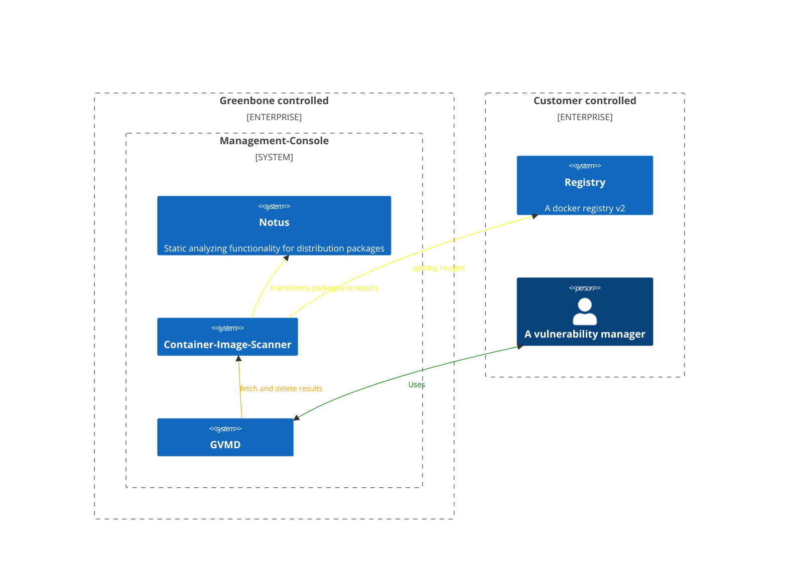
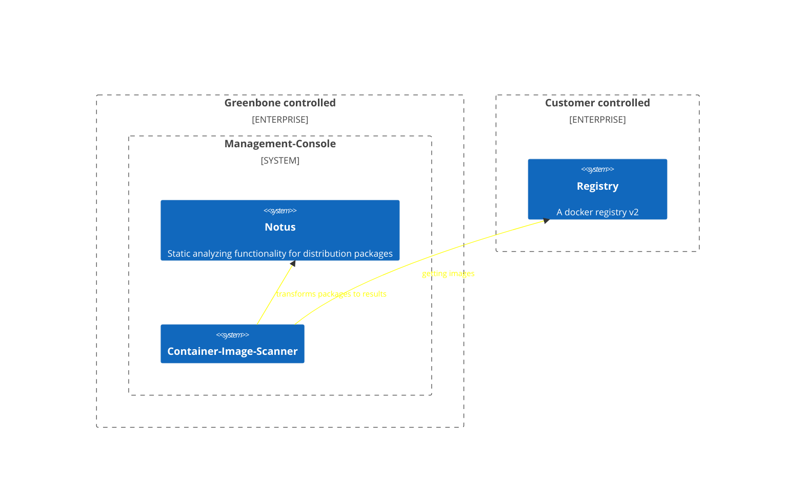
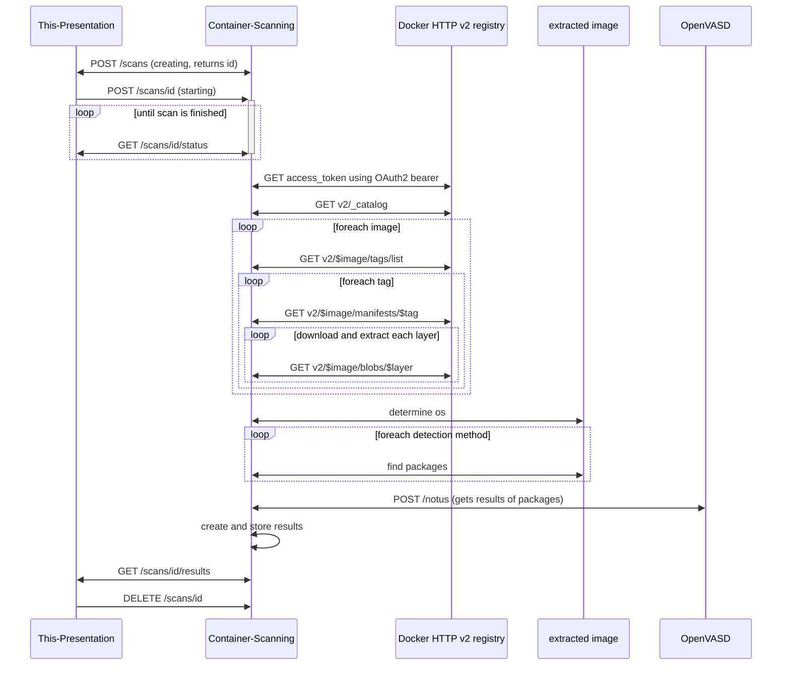
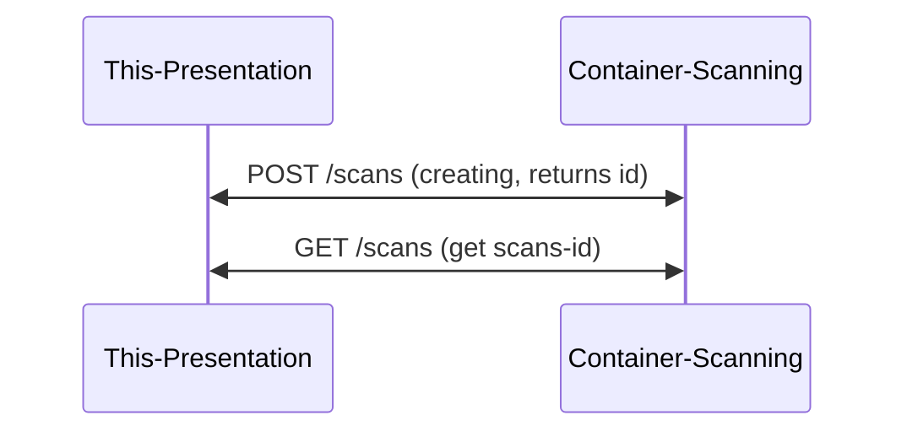
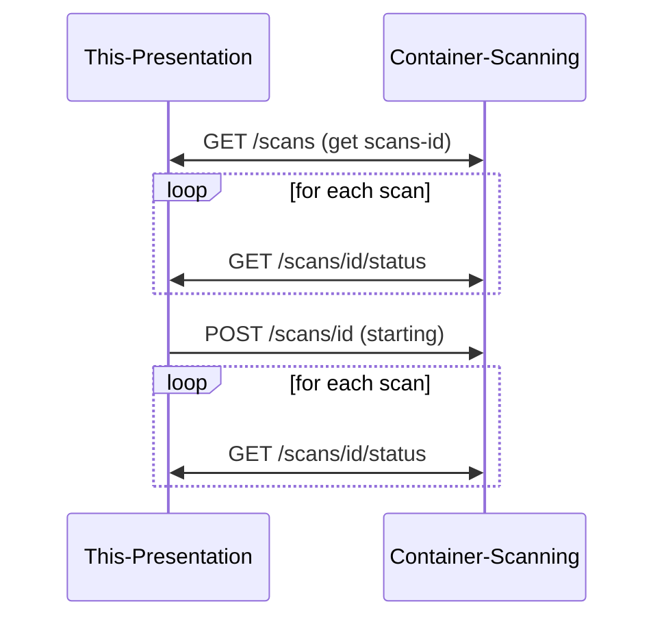
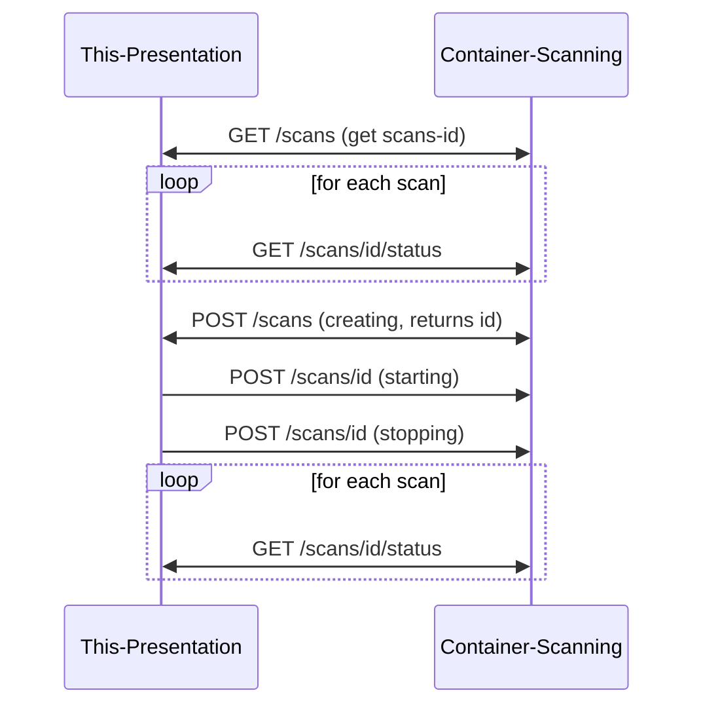
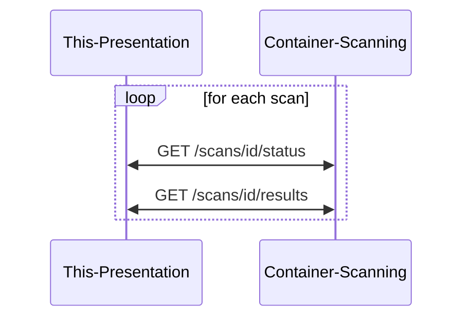
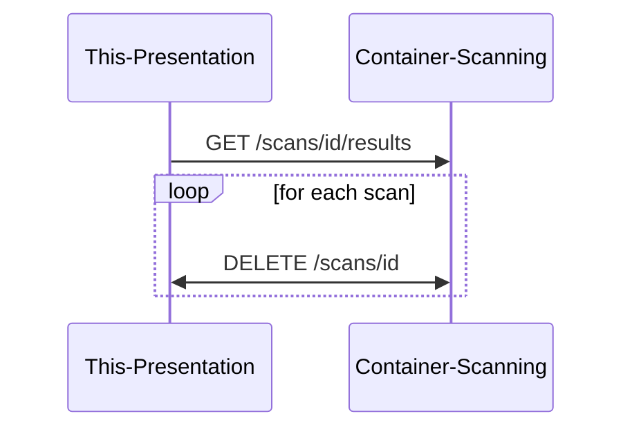

---
theme:
  path: ./dark.yaml
title: "**Container-Image-Scanning**"
sub_title: "A progress demonstration"
author: The container-image-scanning-activity-dev
---
<!-- column_layout: [1, 2, 1] -->

<!-- column: 1 -->

Fahrplan
===
<!--
speaker_note: |
  Hello and welcome to the Container-Image-Scanning progress demonstration.
  
  I am a Container-Image-Scanning-activity-dev and it is my honour today to guide you through this presentation.

  Before we start I want to go through an agenda as well as shouting out some trigger-warnings.

  First I will start with an contextualization, trying to answer the question why is this interesting?, afterwards I will start the demonstration in which I try to answer 'does it work?' and then I will end with the outlook answering the question 'will it stay like that?'

  This is a technical demonstration of a backend-service, which means that you will only see a terminal and unfortunately you will have to endure a very harsh accent throughout my guidance.
-->

* Contextualization (Why is this interesting?)
* Demonstration (Does it work?)
* Outlook (Will it stay like that?)


Trigger-Warnings
---

* This is a technical demonstration of a backend service
* You will only see a terminal
* Very harsh accents included
* Did I mention that you will not see any UI?
<!-- end_slide -->
(Contextualization) Bird-Eye-View
===
<!--
speaker_note: |
  Container-Image-Scanning, as the name implies, is a functionality that downloads images, extract information about installed software from that image and then verifies if those have known vulnerabilities.

  It is integrated as a scanner, meaning that a vulnerability manager does not need to know about the inner workings of that functionality but can just use it as any other scan via the UI.
-->

<!-- column_layout: [1, 2, 1] -->

<!-- column: 1 -->


Key Take-Away
---
- It is integrated into a scanner
- For a user it is transparent over the classical GSA
<!-- reset_layout -->



<!-- end_slide -->

(Contextualization) You are here
===

<!--
speaker_note: |
  This presentation however is just about the Container-Image-Scanning functionality. This means I have to explain some inner workings to you so that you, dear listener, can follow along.

  A Container-Image-Scanner does use an external docker v2 registry to get those images, then it extracts those images, analyzes some parts of that image to get the packages before using Notus to find vulnerabilities.
-->
This presentation is only about Container-Image-Scanner
---


<!-- end_slide -->

(Demonstration) Initialization
===

<!--
speaker_note: |
  Before I can demonstrate you the progress I have to initialize a local registry and a scanner.

  This means I stop previous executions of the scanner, deleting the database of that to have a clean slate.

  Then start a docker registry with self signed certificates and a rudimentary user manager as well as a scanner capable of notus as well as container-image-scanning.

  I will explain the functionality you’ll see in the next couple of minutes:
  - I will show you that we can create scans,
  - start scans,
  - verify the status
  - get results
  - delete the scans

  In the background the container-image-scanner will authenticate itself to the local docker registry, 

  calling catalog to gain all the stored projects, 
  for each project it will get the images and their tags, 
  for each tag it will download and extract each layers. 

  Which is then used to gain information about installed packages.

  Those will then be checked for vulnerabilities using Notus.

  The results will be stored until the scan gets deleted.
-->

<!-- column_layout: [1, 1] -->

<!-- column: 1 -->

```bash +exec
cd ../../ 
# Make sure that nothing is interfering with the demonstration
make stop
make rm-container-image-scanner
# This starts:
# 1. a docker registry with self signed certificates and user management
# 2. pushes needed images into that registry
# 3. starts a scanner
make start
```
<!-- column: 0 -->
What will we demonstrate in the next few minutes:




<!-- end_slide -->

(Demonstration) Do we have scans? No? Ok, we create some.
===
<!--
speaker_note: |
  Throughout the demonstration you will see an abstraction in form of a diagram on the left side that simplifies what is executed on the right side. 
  As a good magician I will show my secrets in form of source-code that is executed on the right side as well as going through the results.

  Here I will demonstrate that we can create scans, first we check if we already have scans.

  As you can see we don't. So we create them by calling POST on /scans with the json you are about to see.

  WARNING: this jumps out of the present

  As you can see we now have 3 scans available for our experiments.
-->

<!-- column_layout: [1, 1] -->

<!-- column: 0 -->



<!-- column: 1 -->

```bash +exec
curl -s localhost:3000/container-image-scanner/scans | jq -C
```

<!-- pause -->

Create the examples
---

```bash +exec +acquire_terminal
cd ../../ 
make create-catalog
make create-openeuler
make create-victim
bat --paging always scans/catalog.json
bat --paging always scans/victim.json
bat --paging always scans/openeuler.json
```

```bash +exec
curl -s localhost:3000/container-image-scanner/scans | jq -C
```

<!-- end_slide -->

(Demonstration) Start scans.
===
<!--
speaker_note: |
  On this slide we start the previously created scans, 
  first we get the status of those scans. 
  As you can see here they are all 'stored', which means they are known but not started.
  Then we will start each scan. 
  Afterwards wer verify that each scan is either started or requested, as you can see here ...
-->

<!-- column_layout: [1, 1] -->

<!-- column: 0 -->


<!-- column: 1 -->

```bash +exec
echo "current status"
curl -s localhost:3000/container-image-scanner/scans | \
  jq -r '.[]' | \
  while read id; do 
    echo -n "$id status: "; curl -s localhost:3000/container-image-scanner/scans/$id/status | jq -r '.status'; 
  done
echo "starting scans"
curl -s localhost:3000/container-image-scanner/scans | \
  jq -r '.[]' | \
  xargs -I{} curl -s -X POST -d '{"action": "start"}' localhost:3000/container-image-scanner/scans/{}
echo "checking status again"
curl -s localhost:3000/container-image-scanner/scans | \
  jq -r '.[]' | \
  while read id; do 
    echo -n "$id status: "; curl -s localhost:3000/container-image-scanner/scans/$id/status | jq -r '.status'; 
  done
```

<!-- end_slide -->
(Demonstration) Stop a scan
===
<!--
speaker_note: |
  Similar to starting scans we can also stop scans. 
  In this case we will create a new scan with the catalog.json, start that and then stop it immediately. 
  This simulates as user that changed their mind.
  And now we can see 4 scans, 3 of them are in ... but one is stopped.
-->

<!-- column_layout: [1, 1] -->

<!-- column: 0 -->


<!-- column: 1 -->

```bash +exec
cd ../../ 
echo "current status"
curl -s localhost:3000/container-image-scanner/scans | \
  jq -r '.[]' | \
  while read id; do 
    echo -n "$id status: "; curl -s localhost:3000/container-image-scanner/scans/$id/status | jq -r '.status'; 
  done
make create-catalog
make start-catalog
make stop-catalog
echo "current status"
curl -s localhost:3000/container-image-scanner/scans | \
  jq -r '.[]' | \
  while read id; do 
    echo -n "$id status: "; curl -s localhost:3000/container-image-scanner/scans/$id/status | jq -r '.status'; 
  done
```
<!-- end_slide -->
Start stopped scan
---
<!--
speaker_note: |
  Starting a stopped scan is as simple as send action: start to that scan.
  To simulate this we are checking for each scan, if it is in status stopped we start it again.
  In the end we check the status of all scans again and we see that the stopped scan is not stopped anymore.
  With this we can basically resume stopped scans.
-->

<!-- column_layout: [1, 1] -->

<!-- column: 0 -->


<!-- column: 1 -->

```bash +exec
echo "current status"
curl -s localhost:3000/container-image-scanner/scans | \
  jq -r '.[]' | \
  while read id; do 
    echo -n "$id status: "; curl -s localhost:3000/container-image-scanner/scans/$id/status | jq -r '.status'; 
  done
echo "start a stopped scan"
curl -s localhost:3000/container-image-scanner/scans | jq -r '.[]' | while read id; do \
  status=$(curl -s localhost:3000/container-image-scanner/scans/$id/status | \
  jq -r '.status'); 
  if [ "$status" = "stopped" ]; then
    echo "Starting scan $id..."; 
    curl -s -X POST -H "Content-Type: application/json" -d '{"action": "start"}' localhost:3000/container-image-scanner/scans/$id; 
    break; 
  fi; 
done
echo "checking status again"
curl -s localhost:3000/container-image-scanner/scans | \
  jq -r '.[]' | \
  while read id; do 
    echo -n "$id status: "; curl -s localhost:3000/container-image-scanner/scans/$id/status | jq -r '.status'; 
  done
```

<!-- end_slide -->
(Demonstration) Status and Results
===
<!--
speaker_note: |
  The call of scans status does return the following json. 
  It does not only contain the status but also the start and the endtime of the scan.
  Which we will use to calculate how long each scan took.

  Additionally we will call scans/results to show the amount of results each scan has.

  For that we may need to wait until each scan is finished. 
  WARNING: may returns immediately may stick to bash
-->

<!-- column_layout: [1, 2] -->

<!-- column: 0 -->



Example status json
---


```json
{
  "start_time": 1751891147,
  "end_time": 1751891175,
  "status": "succeeded",
  "host_info": {
    "all": 4,
    "excluded": 0,
    "dead": 0,
    "alive": 4,
    "queued": 0,
    "finished": 4,
    "remaining_vts_per_host": {}
  }
}
```

<!-- column: 1 -->
Show the amount of results and execution time for each scan:
```bash +exec +acquire_terminal
while true; do
  ids=($(curl -s localhost:3000/container-image-scanner/scans | jq -r '.[]'))
  total=${#ids[@]}
  completed=0

  for id in "${ids[@]}"; do
    status=$(curl -s "localhost:3000/container-image-scanner/scans/$id/status" | jq -r '.status')
    if [ "$status" == "succeeded" ] || [ "$status" == "failed" ]; then
      ((completed++))
    else
      echo "$id ($status): waiting."
    fi
  done
  if [ "$completed" -eq "$total" ]; then
    break
  fi
  sleep 2
done
```

<!-- pause -->
```bash +exec
curl -s localhost:3000/container-image-scanner/scans | jq -r '.[]' | while read id; do
  status_json=$(curl -s localhost:3000/container-image-scanner/scans/$id/status)
  status=$(echo "$status_json" | jq -r '.status')
  duration=$(echo "$status_json" | jq -r '"\(.end_time - .start_time)"')
  results=$(curl -s localhost:3000/container-image-scanner/scans/$id/results | jq 'length')
  echo "$id ($status): results: $results in ${duration}s"
done
```

<!-- end_slide -->
(Demonstration) Results and Delete
===
<!--
speaker_note: |
  First I will show you how an actual result looks like and afterwards we will delete all the scans.
-->

<!-- column_layout: [1, 1] -->
<!-- column: 0 -->


<!-- column: 1 -->

```bash +exec +acquire_terminal
cd ../../ 
make results-openeuler | bat --paging always
```
<!-- pause -->
```bash +exec
curl -s localhost:3000/container-image-scanner/scans | jq -r '.[]' | while read id; do
  curl -X DELETE -s localhost:3000/container-image-scanner/scans/$id
done
echo "All scans should be deleted"
curl -s localhost:3000/container-image-scanner/scans | jq
```

<!-- end_slide -->
(Demonstration) Take-Away
===
<!--
speaker_note: |
  I hopefully convinced you that container-image-scanner can 
  - handle RPM and Debian systems, shown in the nichtsfrei/victim and the openeuler example
  - supports static analyzes of gathered packages using notus,
  - supports docker v2 registry, as seen in the shown results
-->


* Handles RPM as well as Debian package detection
* Supports static analyzes of gathered packages using Notus
* Supports Docker V2 registries
* GET /scans/id/status is implemented
* GET /scans/id/results is implemented
* GET /scans is implemented
* DELETE /scans/id is implemented

<!-- end_slide -->
(Outlook) What's next?
===
<!--
speaker_note: |
  As you can guess we still have a long way to walk. Hopefully less than 500 miles. 

  We need to integrate this functionality onto Greenbone Operating System as well as into the GSA/GVMD so that actual user can benefit from that.

  Additionally we need a test system so that the next demonstration doesn't have to be on my notebook.

  From a functionality point of view we need to add the ZSTD compression as we currently just support GZIP.
  And last but not least we need to extend the gather packages functionality with other non debian or rpm based distributions that are supported by Notus.

  And with that we can move on to the questions/discussion.

  Do you have any questions or comments?
-->

* Integration into GOS
* Integration into GVMD/GSA (GEA integration)
* Creating a test environment (hopefully something that is faster than this notebook)
* Supporting ZSTD compression (currently only GZIP is supported)
* Supporting all operating systems that are supported by Notus

<!-- pause -->

If you have an feedback or any question you can either ask them now or contact me:

mattermost: @pd:scanner:contact

email: philipp.eder@greenbone.net
